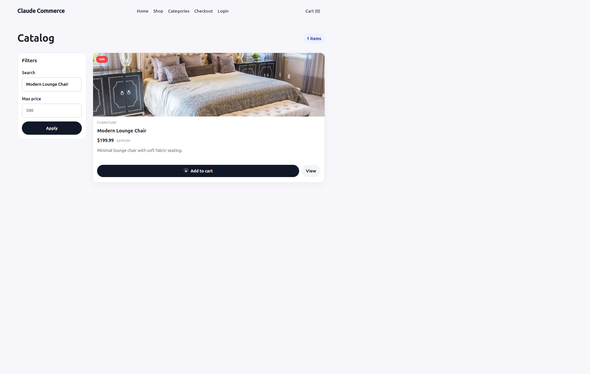
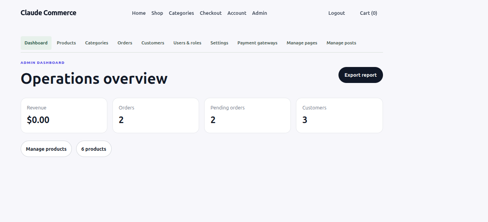

# eCommerce

eCommerce is a full-stack e-commerce application with a Vue storefront, customer account area, and permission-controlled administration panel.

## Features

- Product catalog, product details, search/filter controls, and cart with add confirmation.
- Product gallery with image lightbox and keyboard navigation.
- Customer registration, login, profile/password management, password recovery, address book, and checkout.
- Billing and shipping address selection, saved-address management, order history, and inventory decrement on order creation.
- Admin product/category/order/customer/user management, role permissions, pages/posts, store settings, SMTP, and payment gateway controls.
- MySQL persistence, JWT authentication, encrypted SMTP/provider credentials, and migrations.
- Stripe, PayPal, and cash-on-delivery integration points. Stripe/PayPal require valid provider credentials for live processing.

## Technology

- Frontend: Vue 3, Vite, Vue Router, Pinia, Axios
- Backend: Node.js, Express, MySQL (`mysql2`), JWT, bcrypt
- Database tables use the `ce_` prefix.

## Screenshots






## Local development

Requirements: Node.js 18+, npm, and MySQL 8 or compatible MariaDB.

1. Create `backend/.env` from `backend/.env.example` and configure the MySQL connection, `JWT_SECRET`, and `PAYMENT_CREDENTIALS_KEY`.
2. Create `frontend/.env` from `frontend/.env.example`. Configure `VITE_API_BASE_URL` and `VITE_ADMIN_PATH`.
3. Install backend and frontend dependencies, then initialize the database:

```bash
cd backend
npm ci
npm run db:init
```

In a second terminal:

```bash
cd frontend
npm ci
```

Start the backend (`cd backend && npm run dev`) and frontend (`cd frontend && npm run dev`) in separate terminals. Vite prints the local site URL, usually `http://localhost:5173` or `http://localhost:5174`.

Default local API: `http://localhost:3000`  
Default local admin panel: `/ecomm-manager` (configurable with `VITE_ADMIN_PATH`).

## Demo accounts

These seed accounts are for local development only:

| Role | Email | Password |
| --- | --- | --- |
| Super admin | `admin@claude.local` | `admin123` |
| Customer | `customer@claude.local` | `customer123` |

Change/remove demo credentials before publishing a publicly accessible deployment. Never use these credentials with production customer data.

## Verification

```bash
cd backend && npm test
cd frontend && npm run build
```

## Documentation

- [API documentation](docs/API_DOCUMENTATION.md)
- [Database guide](docs/DATABASE.md)
- [Deployment guide](docs/DEPLOYMENT.md)

## Security notes

- Keep both `.env` files, database dumps, real customer information, and live payment credentials out of GitHub.
- Back up `PAYMENT_CREDENTIALS_KEY`; credentials saved in MySQL cannot be decrypted without the same key.
- Use HTTPS, a strong unique JWT secret, a narrowly scoped CORS allowlist, and production-only credentials for deployment.
